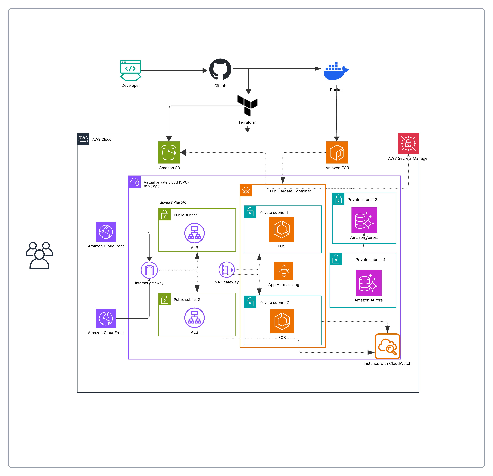

# Node 3-Tier CD Architecture on AWS





A production-grade, fully automated CI/CD architecture for a 3-tier Node.js application running on AWS ECS Fargate with CloudFront CDN, Aurora PostgreSQL, and GitHub Actions.

---

## Architecture Summary

| Tier | Service | Exposure |
|------|---------|----------|
| Web  | ECS Fargate + ALB + CloudFront | Internet-facing |
| API  | ECS Fargate + ALB + CloudFront | Internet-facing |
| DB   | Aurora PostgreSQL (Multi-AZ) | Private subnets only |

---


## Prerequisites

- AWS CLI v2 configured (`aws configure`)
- Terraform ≥ 1.6
- Docker
- GitHub repository with Actions enabled

---

## First-Time Setup

### Bootstrap Terraform State

```bash
# Create S3 bucket for state
aws s3api create-bucket \
  --bucket my-tfstate-bucket \   
  --region us-east-1

aws s3api put-bucket-versioning \
  --bucket my-tfstate-bucket \
  --versioning-configuration Status=Enabled

# Create DynamoDB lock table
aws dynamodb create-table \
  --table-name my-tfstate-lock \
  --attribute-definitions AttributeName=LockID,AttributeType=S \
  --key-schema AttributeName=LockID,KeyType=HASH \
  --billing-mode PAY_PER_REQUEST \
  --region us-east-1
```

Update `terraform/environments/prod/main.tf` backend block with your bucket/table names.

### Deploy Infrastructure

```bash
cd terraform/environments/prod

terraform init
terraform plan -out=tfplan
terraform apply tfplan
```

Capture the outputs — you'll need them for GitHub secrets:

```bash
terraform output
```

###  Configure GitHub Secrets

In your repository → Settings → Secrets and variables → Actions, add:

| Secret | Value |
|--------|-------|
| `AWS_ACCESS_KEY_ID` | IAM user access key |
| `AWS_SECRET_ACCESS_KEY` | IAM user secret key |
| `ECR_WEB_REPO` | `terraform output ecr_web_repo` |
| `ECR_API_REPO` | `terraform output ecr_api_repo` |
| `ECS_CLUSTER` | `terraform output ecs_cluster_name` |
| `WEB_SERVICE` | `node3tier-prod-web-svc` |
| `API_SERVICE` | `node3tier-prod-api-svc` |
| `WEB_TASK_FAMILY` | `node3tier-prod-web` |
| `API_TASK_FAMILY` | `node3tier-prod-api` |
| `CLOUDFRONT_WEB_DOMAIN` | `terraform output cloudfront_web_domain` |
| `CLOUDFRONT_API_DOMAIN` | `terraform output cloudfront_api_domain` |

### Use scripts/sync-secrets.sh
scripts/sync-secrets.sh let you sync your terraform output to Github secret

### Make it executable
``` bash 
chmod +x scripts/sync-secrets.sh
./scripts/sync-secrets.sh

```
### Before running, make sure you have;

``` bash 
# 1. gh CLI installed and authenticated
gh auth login

# 2. jq installed
sudo apt install jq      # Ubuntu/Debian
# or
brew install jq          # Mac

# 3. AWS CLI pointing to the right account
aws sts get-caller-identity

# 4. Terraform apply already completed
cd terraform/environments/prod && terraform output

```

###  Push a commit to `main` to trigger the pipeline

---

## CI/CD Pipeline

```
Push to main
    │
    ├── test          (unit + integration tests, PostgreSQL service container)
    ├── security      (Trivy filesystem scan + npm audit)
    ├── build         (Docker build → ECR, image vulnerability scan)
    └── deploy        (Rolling ECS update → smoke tests)
```

The `deploy` job uses the GitHub **production** environment — configure manual approval gates there if required.

----
# Set up the production environment
This enables the manual approval gate before deploy runs.

Settings
    ↓ \
Environments (left sidebar) \
    ↓ \
New environment \
    ↓ \
Name it exactly: production \
    ↓ \
Configure environment \
    ↓ \
Check "Required reviewers" \
    ↓ \
Add yourself as reviewer \
    ↓ \
Save protection rules

---

Use [Guide](./doc/guide.md) for more detailed guide and operational scripts.

For troubleshooting documentation, check [troubleshootin](./doc/3tiernode-troubleshooting.pdf)


Enjoy!!!